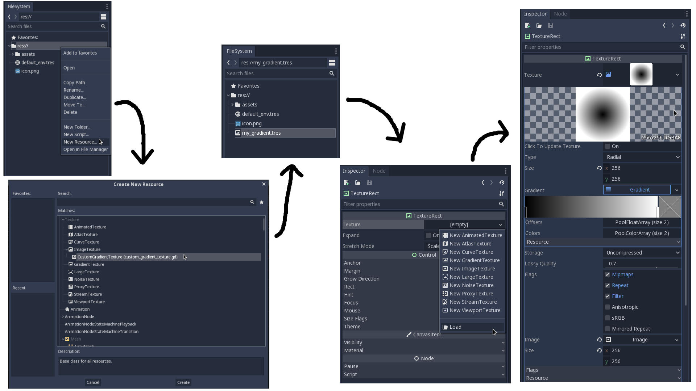

# Godot Custom Gradient Texture

A simple resource for the godot game engine that allows to create linear, radial and rectangular gradient textures unlike the the build-in gradient texture (at this point of time).

##### Note:

- The gradient color doesn't update in the editor due to some issues but the texture can be updated manually by changing one of the other settings or by clicken to the "Click To Update Texture" property in the inspector (See below).
- generating big textures can take 2-3 seconds

## How to create and use the texture:

